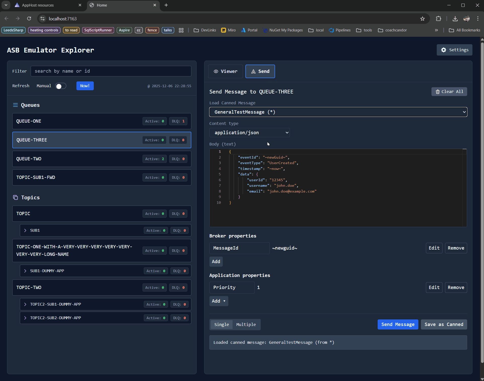

  

# Azure Service Bus Emulator UI

A Blazor-based web UI for exploring and testing Azure Service Bus entities in the [Azure Service Bus Emulator](https://learn.microsoft.com/azure/service-bus-messaging/test-locally-with-service-bus-emulator) especially although not exclusively in Aspire.

Basically postman for the ASB emulator!



## Features

### 🔍 Entity Explorer
- View all **queues** and **topics** from your ASB emulator
- Real-time message counts (Active & Dead-Letter Queue)
- Auto-refresh mode with manual override
- Filter entities by name or ID

### 📨 Message Sender
- Send messages to queues or topics
- **Monaco Editor** with syntax highlighting for JSON, XML, plain text
- Configure broker properties (MessageId, CorrelationId, SessionId, TTL, ScheduledEnqueueTime, etc.)
- Configure application properties
- **Placeholder syntax** for dynamic test data
- **Canned Messages** library:
  - Save frequently used messages
  - Organize by category
  - **AI Generation**: Generate message templates using AI (requires an LLM)
- **Quick Values** clipboard helper (new GUIDs, timestamps)

### 👀 Message Viewer
- Peek or Receive messages from queues
- Monaco Editor for message body viewing
- Display broker and application properties

### ⚙️ Settings Management
- **Persistence**: Settings are saved to `localStorage` and automatically loaded.
- **Import/Export**: Export settings to JSON for sharing or backup.
- Manage content types and common application properties.

## Quick Start

### Wiring up in Aspire

1.  Add the `AspireAsbEmulatorUi.Hosting` package to your AppHost project.
2.  Use the `AddAsbEmulatorUi` extension method to add the UI resource and wire it up to your Azure Service Bus resource.

```csharp
var builder = DistributedApplication.CreateBuilder(args);

// Add Azure Service Bus and configure it to run with the emulator
var serviceBus = builder
    .AddAzureServiceBus("myservicebus")
    .RunAsEmulator(c => c.WithLifetime(ContainerLifetime.Persistent));

// Add the ASB Emulator UI
builder.AddAsbEmulatorUi("asb-ui", serviceBus);

builder.Build().Run();
```

### Environment Variables

The application uses the following environment variables for configuration:

| Variable | Description |
|----------|-------------|
| `asb-sql-connectionstring` | Full connection string to the ASB Emulator's SQL backend. Overrides other SQL settings. |
| `asb-sql-port` | Port of the SQL server (automatically set by `AddAsbEmulatorUi`). |
| `asb-sql-password` | Password for the `sa` user (automatically set by `AddAsbEmulatorUi`). |
| `asb-emulator-sqlserver` | Hostname (and optional port) of the SQL server. Useful for custom networking setups. |
| `AsbEmulatorUi__SettingsOverride` | JSON string to override application settings (Canned Messages, etc.). |

## Placeholder Syntax

Use placeholders in message bodies for dynamic test data:

| Placeholder | Example Result |
|-------------|----------------|
| `~newGuid~` | `a1b2c3d4-e5f6-7890-abcd-ef1234567890` |
| `~now~` | `2024-01-15T10:30:00.0000000Z` |
| `~now+5m~` | 5 minutes from now |
| `~now+1h~` | 1 hour from now |
| `~now+1d~` | 1 day from now |
| `~now-5m~` | 5 minutes ago |

**Example:**
```json
{
  "orderId": "~newGuid~",
  "customerId": "~newGuid~",
  "timestamp": "~now~",
  "scheduledDelivery": "~now+5m~",
  "expiresAt": "~now+1d~"
}
```

## Important Notes

**Azure Service Bus Message Flow:**
- **Queues**: Send → Queue → Receive ✅
- **Topics**: Send → Topic → Subscriptions → Receive ✅
  - Send messages **TO topics** (not subscriptions)
  - Topics automatically distribute to subscriptions
  - Subscriptions are hidden in the UI (by design)
  - Topic active count may show 0 (messages are in subscriptions)

## Tech Stack
- **Blazor Interactive Server** - Real-time UI
- **Tailwind CSS** - Modern styling
- **Monaco Editor** - VS Code-powered editing
- **Azure Service Bus Client SDK** - Native ASB operations
- **.NET 10** - Latest .NET

## Documentation
- [PlaceholderSyntax.md](docs/PlaceholderSyntax.md) - Complete placeholder reference
- [FeatureGuide.md](docs/FeatureGuide.md) - Detailed feature documentation

## API

The application exposes a simple REST API for integration testing and automation.

### Send Canned Message

Triggers the sending of a pre-configured "Canned Message" to a specific entity.

```http
POST /api/canned/{entity}/{scenario}
```

| Parameter | Type | Description |
|-----------|------|-------------|
| `entity` | Route | The name of the queue or topic (e.g., `orders-queue`). |
| `scenario` | Route | The name of the canned message scenario (e.g., `OrderCreated`). |

**Response:**

```json
{
  "success": true,
  "entity": "orders-queue",
  "scenario": "OrderCreated",
  "messageId": "a1b2c3d4...",
  "sentAt": "2024-01-15T12:00:00+00:00"
}
```

This is particularly useful for triggering test scenarios from external tools or scripts.

## License
MIT License
